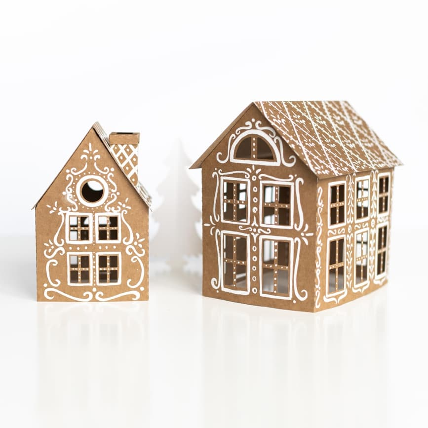

# House Assembly

## PLEASE NOTE
- The front side is the one where folding strips are not visible.
- If needed, color only the front side of the house.
- The house doors can be bent in any direction as you wish.
- Electronic candles (if included in the set) are placed inside the house.
- The assembly scheme below works for both houses.

## Step-by-step Instructions

1. Using paints and a brush, **color the front sides of the house** to your taste and wait for the paint to dry. It will be more difficult to paint the house when it's assembled.
2. Bend the house parts along the folding lines. 
3. Apply glue to the adhesive strip and glue the two parts of the house together. 
4. Apply glue and stick the two parts of the house together from the other side. 
5. Bend the roof along the folding line and place it on the table. **WITHOUT APPLYING GLUE**, place the house against the roof and mark with a pencil where the house should be glued to the roof. 
6. Apply glue to the roof adhesive strips on one side of the house. 
7. Place the glued strips onto the roof at the marked spots. Make sure the house ends at the roof's folding line. From inside the house, press the adhesive strips with your fingers to properly attach the house to the roof. 
8. Apply glue to the roof adhesive strips on the other side. 
9. Again, place the house with the roof on the table and press the adhesive strips to the roof from inside the house. 
10. The house is assembled. The large house is assembled using the same scheme. 

## Additional Steps for Small House with Chimney

11. Bend the chimney base along the folding strips and glue its narrowest part. 
12. Bend the chimney top along the folding strips. 
13. One by one, apply glue and attach the side corners of the chimney to its sides. 
14. Find the slots for the pipe in the house roof. Insert it into the slots. 
15. Firmly but carefully pull the chimney towards the house roof from the inside. 
16. Put on the chimney cap. 

# Christmas Tree Assembly

## PLEASE NOTE

- The tree stem should be glued as evenly as possible to maintain balance.

## Step-by-step Instructions

1. Bend the three tree elements vertically. 
2. You should have three identical tree parts in your hands. Apply glue to each of them on one side and connect all three parts.  
3. You should end up with a tree with three sides. 
4. Place the tree next to the house. The composition is ready! Happy holidays! 

Ievgeniia Schastlyva
Instagram: [@janepopcorn](https://www.instagram.com/janepopcorn/)