# Інструкція


## Складання будинку

### ЗВЕРНІТЬ УВАГУ
- Лицева сторона – це та, на якій не видно смужок для згинання. 
- За потреби розмальовуйте саме лицеву сторону будинку.
- Двері будинку можуть бути вигнуті у будь-яку сторону за вашим бажанням.
- Електронні свічки (за наявності у комплекті) розміщуються у середині будинку.
- Наведена нижче схема складання підходить для обох будинків.

### Покрокова інструкція

1. За допомогою фарб та пензлика, розфарбуйте лицеві сторони будинку за вашим смаком та дочекайтесь поки фарба висохне. У зібраному стані, фарбувати будинок буде складніше.
2. Зігніть частини будинку по лініям для згинання. 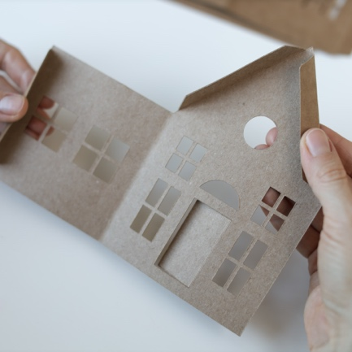
3. Змастіть клеєм смужку для склеювання та склейте дві частини будинку між собою. 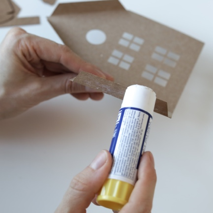
4. Pмастіть клеєм та склейте дві частини будинку з іншої сторони. 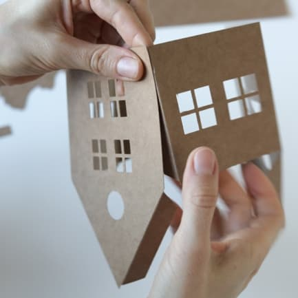
5. Зігніть дах по лінії згинання та покладіть його на стіл. 
**НЕ НАМАЗУЮЧИ КЛЕЄМ**, прикладіть будинок до даху та олівцем відмітьте місця, де має буди приклеєно будинок до даху. 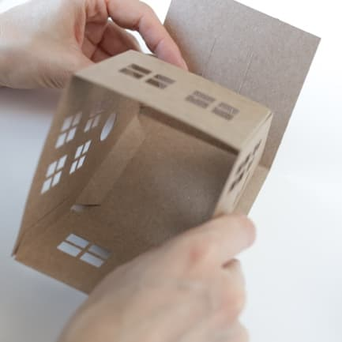
6. Змастіть смужки для склеювання даху з однієї сторони будинку. 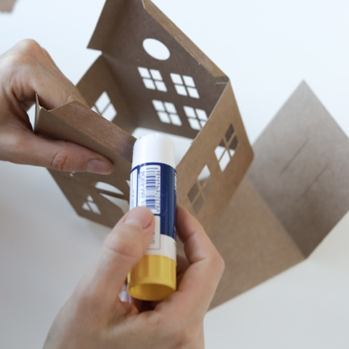
7. Прикладіть змазані смужки до даху у позначених місцях. Переконайтесь, що будинок закінчується на лінії згинання даху. З середини будинку притисніть пальцями смужки для склеювання, щоб гарно приклеїти будинок до даху. 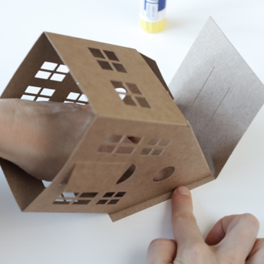
8. Змастіть смужки для приклеювання даху з іншої сторони. 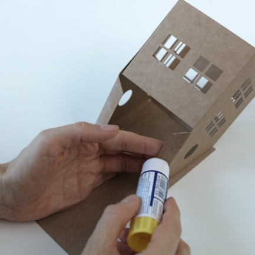
9. Знову покладіть будинок дахом на стіл та притисніть смужки для склеювання до даху зсередини будинку. 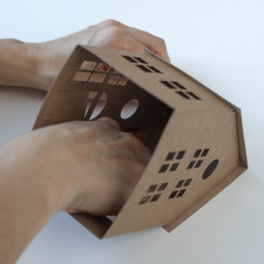
10.	Будинок зібрано. Великий будинок збирається за такою ж схемою. 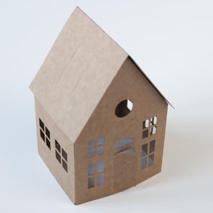

### Додатково для малого будинку з димовою трубою

11.	Зігніть тіло димової труби по смужкам для згинання та склейте найвужчу її частину. 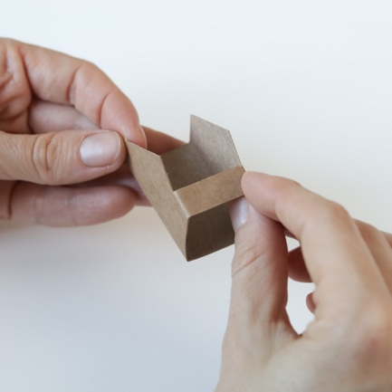	
12.	Зігніть по смужкам для згинання верхівку димової труби.	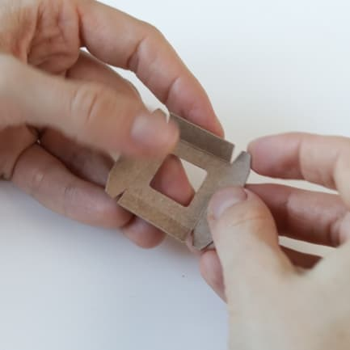
13.	По черзі змастіть клеєм та приклейте бокові кути димової труби до його сторін. 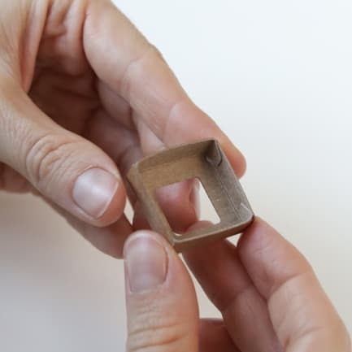
14.	Знайдіть у даху будинку прорізи для труби. Вставте її у прорізи. 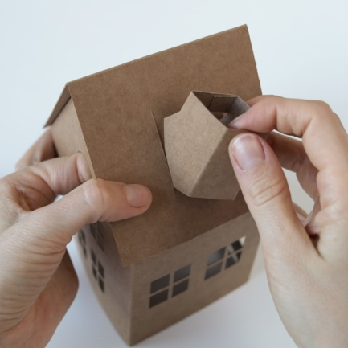
15.	Щільно, але обережно притягніть димову трубу до даху будинку зсередини.	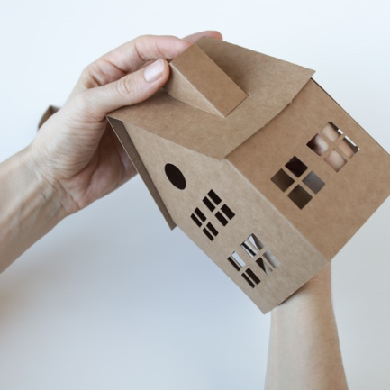
16.	Вдягніть шапку димової труби. 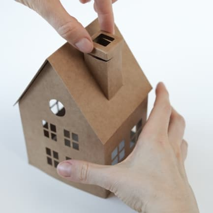

## Складання ялинки

### ЗВЕРНІТЬ УВАГУ
- Елементи ялинки мають згинатись у бік лицевої сторони, тобто, у протилежний бік до згинання будинків.
- Ніжка ялинки має бути склеєна якомога рівніше для підтримування рівноваги.

### Покрокова існтрукція
 
1. Зігніть три елементи ялинки по вертикалі у протилежний бік до лінії згинання. 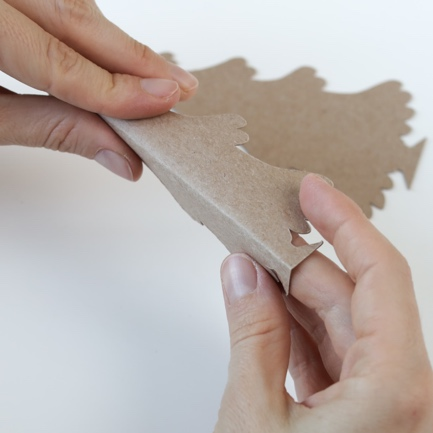
2. Повністю змастіть клеєм тильну сторону однієї частини ялинки та приклейте до неї дві інші частини ялинки чорновою стороною. 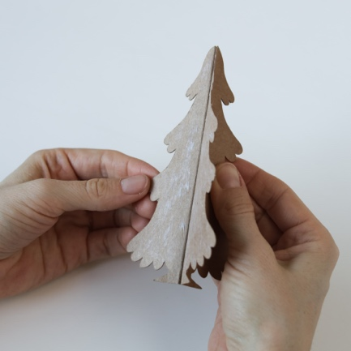
3. Склейте між собою чорнові частини ялинки що залишились. 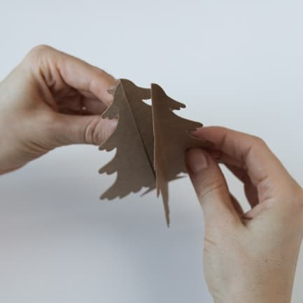
4. Має вийти ялинка з трьома сторонами.	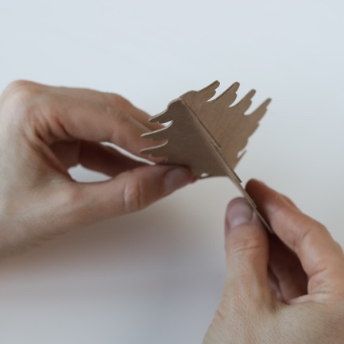
5. Розмістить ялинку поруч з будинком. Композиція готова! Гарних свят! 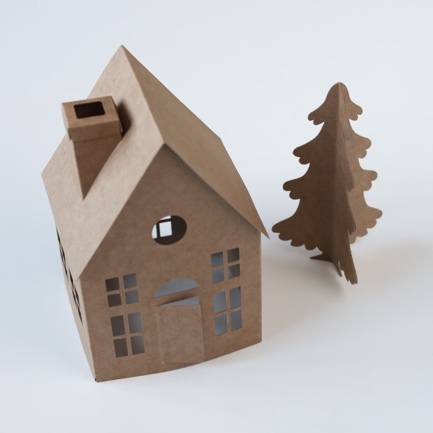

```
Євгенія Счастлива
Instagram: @janepopcorn
Телефон: +380 96 366 8456
```