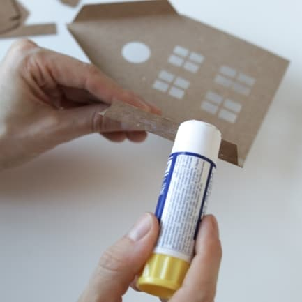
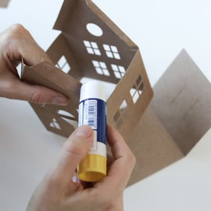
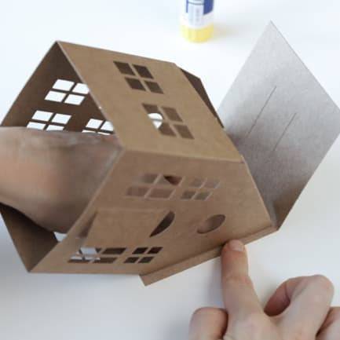
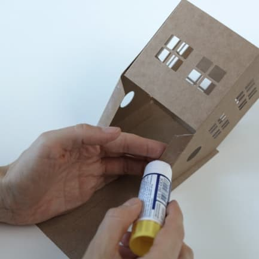
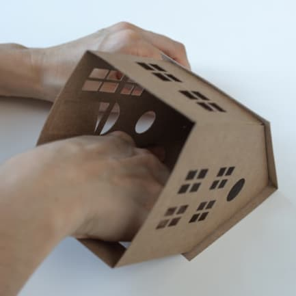
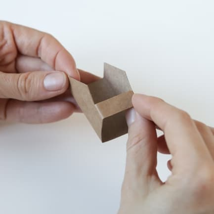
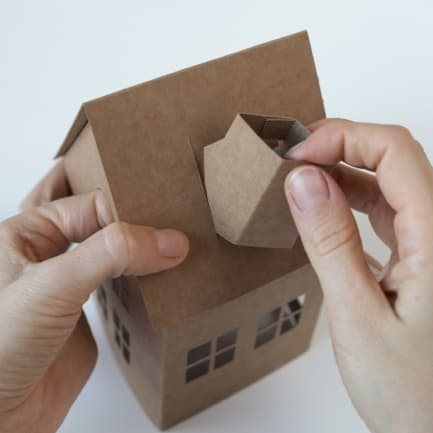
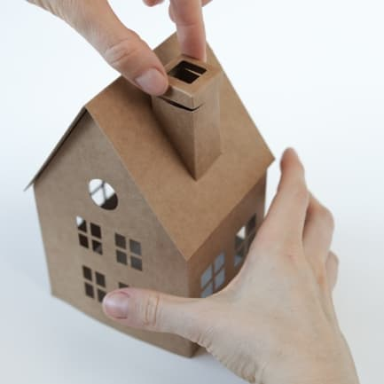
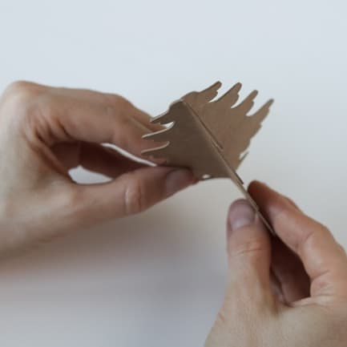

# Інструкція


## Складання будинку

### ЗВЕРНІТЬ УВАГУ
- Лицьова сторона – на якій не видно смужок для згинання.
- За потреби розмальовуйте саме лицьову сторону будинку.
- Двері будинку можуть бути вигнуті у будь-яку сторону за вашим бажанням.
- Електронні свічки (за наявності у комплекті) розміщуються у середині будинку.
- Наведена нижче схема складання підходить для обох будинків.

### Покрокова інструкція

1. За допомогою фарб та пензлика, **розфарбуйте лицьові сторони будинку** за вашим смаком та дочекайтеся висихання фарби. У зібраному стані фарбувати будинок буде складніше.
2. Зігніть частини будинку по лініям для згинання. 
3. Змастіть клеєм смужку для склеювання та склейте дві частини будинку між собою. 
4. Намастіть клеєм та склейте дві частини будинку з іншої сторони. 
5. Зігніть дах по лінії згинання та покладіть його на стіл. **НЕ НАМАЗУЮЧИ КЛЕЄМ**, прикладіть будинок до даху та олівцем відмітьте місця, де має буди приклеєно будинок до даху. 
6. Змастіть смужки для склеювання даху з однієї сторони будинку. 
7. Прикладіть змазані смужки до даху у позначених місцях. Переконайтесь, що будинок закінчується на лінії згинання даху. З середини будинку притисніть пальцями смужки для склеювання, щоб гарно приклеїти будинок до даху. 
8. Змастіть смужки для приклеювання даху з іншої сторони. 
9. Знову покладіть будинок дахом на стіл та притисніть смужки для склеювання до даху зсередини будинку. 
10. Будинок зібрано. Великий будинок збирається за такою ж схемою. 

### Додатково для малого будинку з димоходом

11. Зігніть основу димоходу по смужкам для згинання та склейте найвужчу її частину. 
12. Зігніть по смужкам для згинання верхівку димоходу. 
13. По черзі змастіть клеєм та приклейте бокові кути димоходу до його сторін. 
14. Знайдіть у даху будинку прорізи для труби. Вставте її у прорізи. 
15. Щільно, але обережно притягніть димохід до даху будинку зсередини. 
16. Вдягніть шапку димоходу. 

## Складання ялинки

### ЗВЕРНІТЬ УВАГУ

- Ніжка ялинки має бути склеєна якомога рівніше для збереження рівноваги.

### Покрокова існтрукція

1. Зігніть три елементи ялинки по вертикалі. 
2. Ви маєте на руках три однакові частини ялинки. Змастіть кожну з них клеєм з однієї сторони та з’єднайте всі три частини.  
3. Має вийти ялинка з трьома сторонами. 
4. Розмістить ялинку поруч з будинком. Композиція готова! Гарних свят! 

```
Євгенія Счастлива
Instagram: [@janepopcorn](https://www.instagram.com/janepopcorn/)
```